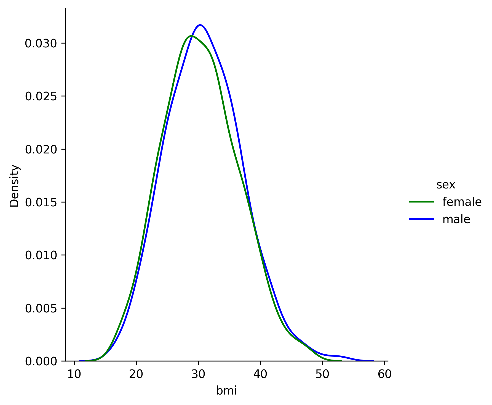
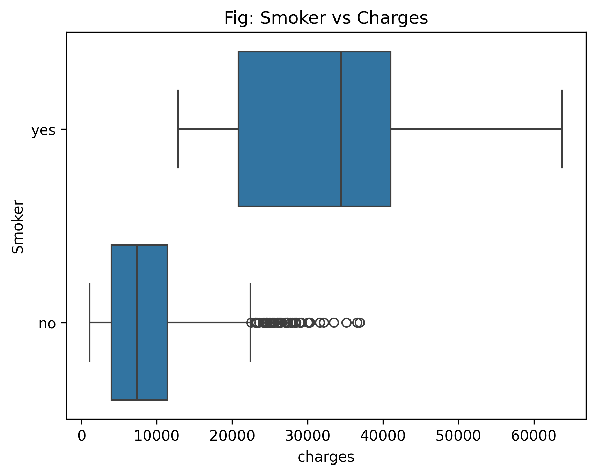
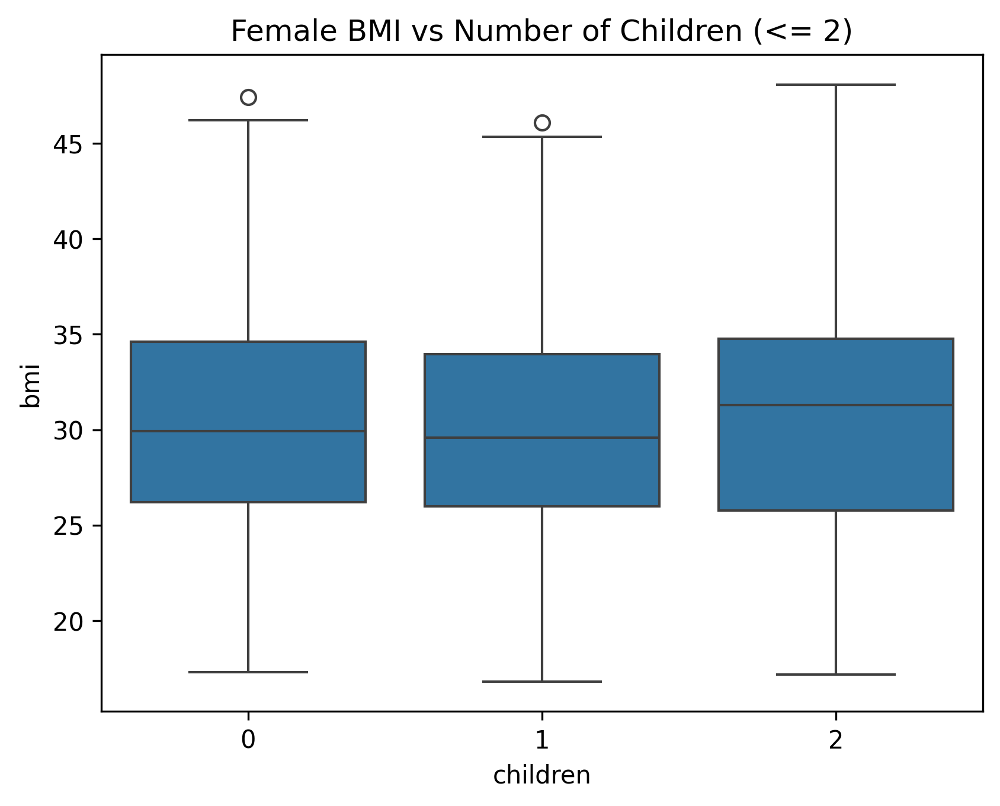
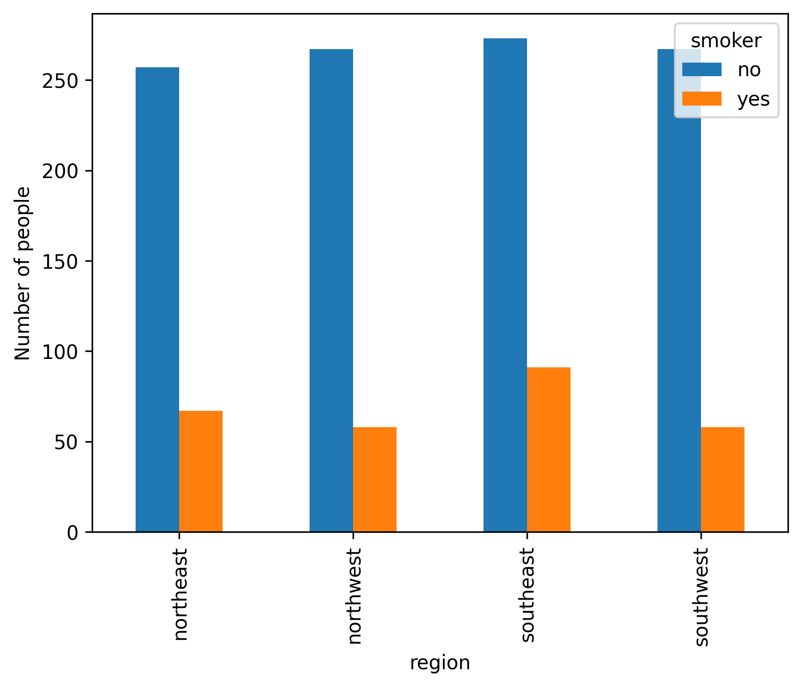

# hypotest
ibm hypothesis 

Leveraging customer information is important for most businesses. This project is to practice hypothesis testing to help decide, using statistical evidence, a certain effect of an attribute or a combination of attributes on insurance claims. This is to highlight the imoprtance of the inital steps of decision making before buildingteh prediction models and classifiers.

Concepts Touched:
- Understand the elements of hypothesis testing:
    - choose a sample statistic
    - Define hypothesis
    - Set the decision criteria
    - Evaluate and interpret results

Packages needed are:
- reqeusts for data fetching 
- pandas for managing data
- numpy for math operations
- seaborn for data visualization
- matplotlib for data visualization
- plotly.express for data visualization
- statsmodels for statistical analysis
- sklearn for machine learning & machine-learning pipeline related functions

## Findings

All statistical tests were conducted at a significance level of α = 0.05, corresponding to 95 % confidence for interval estimates.


There was no statistical difference between each gender's average BMI (p-value = 0.09). The t-value of the T-test was found that the average male BMI was 1.7 standard errors greater than the average female BMI.



After performing a t-test, it was found that smokers were charged significantly more than non-smokers (p-value = 8.27e-283). The t-value showed that smokers were charged 46.66 stadard errors greater than non-smokers.



This is a box plot that shows women grouped by number of children and compared their average BMI's. It was found that the number of children (<= 2 children) didn't have a statistical significance on the woman's BMI (p-value: 0.72). The p-value was run using an Ordinary Least Squares model and created an ANOVA table.

| Source       | df   | Sum Sq   | Mean Sq  | F        | p-value |
|--------------|------|----------|----------|----------|---------|
| C(children)  | 2    | 24.59    | 12.30    | 0.334    | 0.716   |
| Residual     | 563  | 20 695.66| 36.76    | —        | —       |


This bar chart depicts the number of smokers to non-smokers per region. After performing a chi square test it was found that there was no statistical difference in the proportion of smokers:non-smokers per region (p-value: 0.06)

## Set up venv
Create the virtual environment to download needed packages
```bash
    python3 -m venv venv
```
Activate environment:

MAC/Linux
``` 
 source venv/bin/activate 
```
Windows(CMD)
```
    .\venv\Scripts\activate.bat
```
Windows(PowerShell)
```
    .\venv\Scripts\Activate
```

Install packages:
```
    pip isntall pandas seaborn numpy matplotlib scikit-learn requests plotly pathlib
```

To ensure that the packages are installed run `pip list` in the terminal with the venv active

**Known issue**:
    Be sure to change the interpreter to the venv corresponding interpreter to recognize the downloaded packages